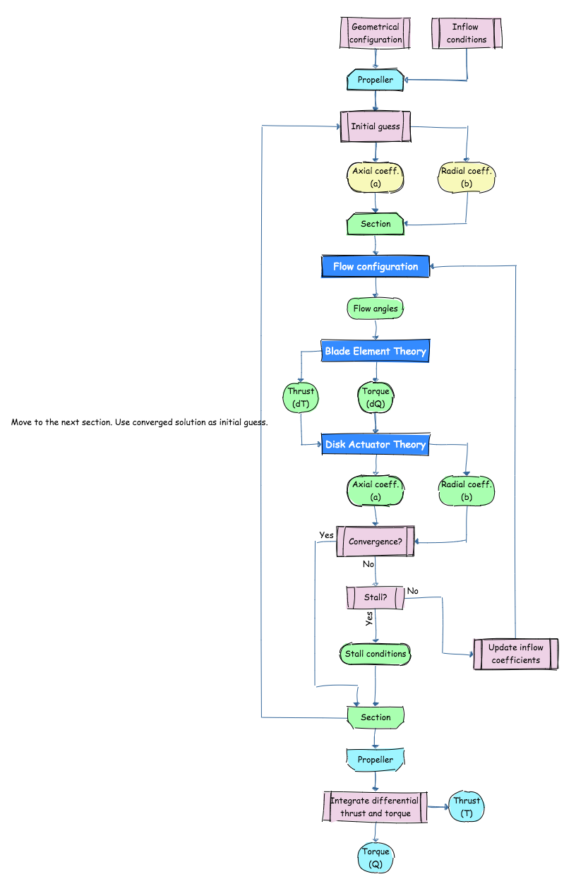

# pybem


[](https://www.gnu.org/licenses/gpl-3.0) [](https://travis-ci.org/KikeM/pybem)

Blade Element Method implementation for propeller calculations.

## Iteration process



## Quickstart

```python
import matplotlib.pyplot as plt

import numpy as np
from pybem import BladeElementMethod

bem = BladeElementMethod()
    
# Quick polar
# -----------------------------
def cl(alpha):

    from math import pi
    
    return 2*pi*(alpha)

def cd(cl):
    
    return 0.012 + 0.05 * cl**2

alpha = np.linspace(-40, 40, 50)
alpha_r = np.deg2rad(alpha)

cl_alpha = cl(alpha_r)
cd_polar = cd(cl_alpha)

# -------------------------------

# Lenghts
D = 0.152 * 2 # meters
r_tip = D / 2.0
r_hub = r_tip * 0.15 

# Propeller
# ---------------------------------
r    = np.linspace(r_hub, r_tip)
beta = np.linspace(80, 50)
chord = 0.2 * r
# ---------------------------------

# Load airfoil
bem.load_airfoil(alpha, cl_alpha, cd_polar)

# Load advance ratio
J = 1
bem.load_similarity(J = J)

prop = bem.load_propeller(dist_r=r, dist_beta=beta, dist_chord = chord, n_blades = 4)
bem.set_tip_loss(True)

# Test!
_r = r[25] / D
phi0 = np.arctan(J/_r)
phi0 = np.rad2deg(phi0)
phi = bem.compute_inflow_angle(_r, phi0)
```
